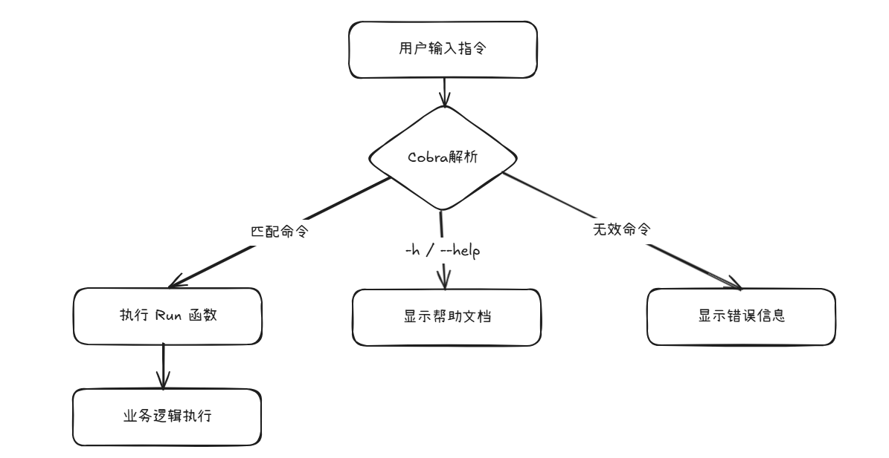
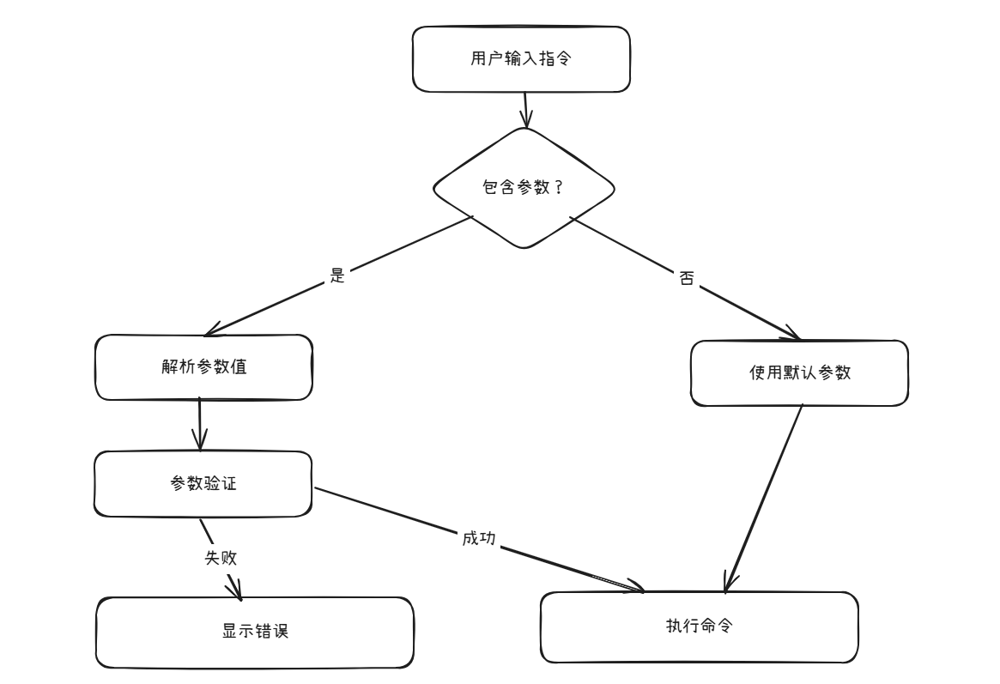
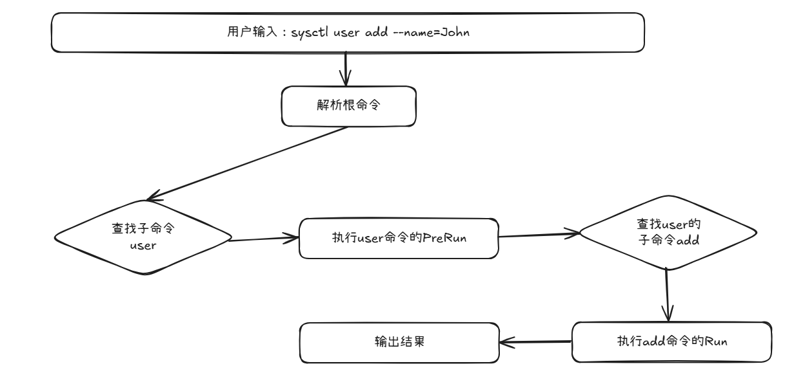

# Cobra

## Cobra 简单认识与使用

### 1. Cobra 是什么？

`Cobra` 是一个用于构建 **命令行应用（CLI）** 的 `Go` 语言库。它提供了创建命令、子命令、参数解析、帮助文档生成等能力，帮助开发者快速开发专业级的命令行工具。

---

### 2. 有什么用？能解决什么问题？

- **问题**​：开发 `CLI` 工具时需要处理复杂的参数解析（如 `-v/--verbose`）、多级命令（如 `git commit -m "msg"`）、自动生成帮助文档等。
- **解决方案**​：`Cobra` 封装了这些重复工作，让开发者专注于核心业务逻辑。
- **核心能力​**：
    - 创建嵌套命令（命令+子命令）
    - 自动生成帮助文档（`--help`）
    - 支持短/长参数（`-v/--verbose`）
    - 支持参数验证和默认值

---

### 3. 什么场景下会用到？​

假设要开发以下工具：
- 一个类似 `git` 的版本控制工具：`myGit commit -m "message"`
- 本地开发工具：`dev build --debug`
- 服务器管理工具：`server start --port=8080`（此处指定端口号）
> 在依托于代码管理平台存储代码时，项目中可能需要一个配置文件，我们可能更多的会提供一个项目配置文件模板，而不是本地开发中实际包含开发环境信息的配置文件。此时，可以借助`Cobra`在程序启动的时候指定配置文件，来实现服务的正常启动。

---

## Cobra 使用的基本认识

### 0. 包引入

```bash
go get github.com/spf13/cobra
```

---

### 1. 简单代码与使用示例

> Go 代码示例
```go
package main

import (
	"fmt"

	"github.com/spf13/cobra"
)

func main() {
	var rootCmd = &cobra.Command{
		Use:   "simple",
		Short: "一个简单的例子",
		Long:  "这个例子演示了根命令的执行",
		// 设置根命令的Run函数
		Run: func(cmd *cobra.Command, args []string) {
			fmt.Println("你好，这是根命令在执行！")
		},
	}

	rootCmd.Execute()
}
```

> 操作演示效果

```bash
# 示例：开始 -----------------------------------------------------------------------------
➜  file-tool git:(learn/cobra) ✗ go build -o simple   # 编译成可执行程序
➜  file-tool git:(learn/cobra) ✗ ./simple             # 直接执行
你好，这是根命令在执行！
➜  file-tool git:(learn/cobra) ✗ 
➜  file-tool git:(learn/cobra) ✗ ./simple --help      # 带 --help 参数执行 => 帮助文档
这个例子演示了根命令的执行

Usage:
  simple [flags]

Flags:
  -h, --help   help for simple
➜  file-tool git:(learn/cobra) ✗ 
# 示例：结束 -----------------------------------------------------------------------------
```

---

### 2. Cobra 命令基本认识

在 `Cobra` 中，一个命令（Command）由以下几个重要部分组成：

- **​Use**: 命令的调用名称。比如在根命令中，我们通常用可执行文件的名字，如 `simple`。在子命令中，比如`create`，那么调用就是`simple create`。
- **Short**: 命令的简短描述，通常在帮助文档的列表中出现。
- **Long**: 命令的详细描述，当用户查看具体命令的帮助（如`simple create --help`）时会显示。
- ​**Run**: 当命令被执行时调用的函数。这个函数就是命令要执行的业务逻辑。

另外，还可以给命令添加参数（Flags）。参数分为两种：
- 持久参数（Persistent Flags）​​：可以作用于该命令及其所有子命令。
- 本地参数（Local Flags）​​：仅作用于当前命令。

---

### 3. 示例代码与Cobra命令认识的解读

```go
func main() {
    // 创建根命令（顶级命令）
	var rootCmd = &cobra.Command{
        // 指定命令名称
        Use:   "simple",
        // 命令的简短描述
		Short: "一个简单的例子",
        // 命令的详细描述（使用 -h/-help后输出的提示）
		Long:  "这个例子演示了根命令的执行",
		// 当命令被执行时调用的方法（此处即使用simple指令会调用执行这个方法）
		Run: func(cmd *cobra.Command, args []string) {
			fmt.Println("你好，这是根命令在执行！")
		},
	}

	rootCmd.Execute()
}
```

---

#### 根命令（顶级命令）也是默认命令
> 在执行CLI程序时，若不指定调用的命令，就是执行根命令。
- 即，如果把如上程序编译成名为 `test` 的可执行文件，直接 `./test`或`./test simple`效果是一样的。

```bash
# 示例：开始 -----------------------------------------------------------------------------
➜  file-tool git:(learn/cobra) ✗ go build -o test
➜  file-tool git:(learn/cobra) ✗ ll
总计 3.3M
-rw-rw-r-- 1 devuser devuser  377  6月 22 17:31 main.go
-rwxrwxr-x 1 devuser devuser 3.3M  6月 22 18:15 test
➜  file-tool git:(learn/cobra) ✗ ./test 
你好，这是根命令在执行！
➜  file-tool git:(learn/cobra) ✗ ./test simple
你好，这是根命令在执行！
➜  file-tool git:(learn/cobra) ✗ 
# 示例：结束 -----------------------------------------------------------------------------
```

**注意**：
根命令的 `Use` 值建议与可执行文件名一致，但不是强制性的
当调用方式与 `Use` 值不匹配时：
```bash
# 当 Use 为 "simple" 时：
./test simple   # 正常执行根命令
./test demo     # 会显示错误：unknown command "demo"
```

---

#### Run 参数是必须的吗？

**答案**：Run字段不是必须的，如果不设置，执行命令时`Cobra`会显示帮助信息（即`Long`或`Short`的内容）。
> 注释掉 `Run` 部分代码
```bash
# 示例：开始 -----------------------------------------------------------------------------
➜  file-tool git:(learn/cobra) ✗ go build -o test
➜  file-tool git:(learn/cobra) ✗ ./test          
这个例子演示了根命令的执行

➜  file-tool git:(learn/cobra) ✗ ./test simple   
这个例子演示了根命令的执行

➜  file-tool git:(learn/cobra) ✗ 
# 示例：结束 -----------------------------------------------------------------------------
```

---

#### 哪些参数是必须的？

**答案**：没有。
> 只保留 `Run` 部分代码
```bash
# 示例：开始 -----------------------------------------------------------------------------
➜  file-tool git:(learn/cobra) ✗ go build -o test
➜  file-tool git:(learn/cobra) ✗ ./test       # 直接执行
你好，这是根命令在执行！                          # 调用 Run 对应的方法输出内容
➜  file-tool git:(learn/cobra) ✗ ./test -h    # 查看命令详情
Usage:
   [flags]

Flags:
  -h, --help   help for this command
➜  file-tool git:(learn/cobra) ✗ 
# 示例：结束 -----------------------------------------------------------------------------
```

---

### 4. 必看小结

#### 4.1 根命令 Use 字段的隐含逻辑

根命令的 Use 值建议与可执行文件名一致，但不是强制性的

当调用方式与 Use 值不匹配时：

```bash
# 当 Use 为 "simple" 时：
./test simple   # 正常执行根命令
./test demo     # 会显示错误：unknown command "demo"
```

---

#### 4.2 Run 函数支持参数解析

当存在位置参数时：

```go
Run: func(cmd *cobra.Command, args []string) {
    fmt.Println("位置参数:", args)
}
```

使用：

```bash
./simple file1.txt file2.jpg
# 输出: 位置参数: [file1.txt file2.jpg]
```

---

#### 4.3 -h/--help 帮助系统的智能行为

当使用 `-h/--help` 时，即表示要输出命令帮助信息。
- `-h/--help`：是Cobra内置提供的。

**工作原理**​：当系统检测到 --help 时，Cobra 会：
- 收集命令的 Short/Long/Example
- 列出所有可用子命令
- 显示参数说明
- **​跳过 Run 函数执行**

> - 当用户输入 --help 时，Cobra 会阻止执行 Run 函数
> - 帮助系统完全独立于业务逻辑

```go
var rootCmd = &cobra.Command{
    // 省略Short/Long...
    Run: func(cmd *cobra.Command, args []string) {
        // 这里不会执行
    },
}
```

---

#### 4.4 核心字段作用总结表

|字段	|必要性	|显示位置	|作用说明|
|:------|:------|:------|:------|
|Use	|推荐	|帮助文档/错误提示	|定义命令调用方式|
|Short	|推荐	|命令列表(help主界面)	|简洁描述命令功能|
|Long	|可选	|命令详细帮助(子命令帮助)	|提供详细使用说明|
|Run	|可选	|-	|命令的核心业务逻辑|

---

#### 4.5 典型工作流程图示



---

#### 4.6 最小推荐配置

至少携带：`Use`、`Short`、`Run`

```go
// 最小推荐配置
&cobra.Command{
    Use:   "有意义的名称",
    Short: "简洁描述(20字内)",
    Run:   yourLogic, // 实际业务逻辑
}
```

---

## Cobra 命令与参数

### 1. 基本认识

在 `Cobra` 中，**​命令**代表一个可执行的操作（如 `create`），而**参数**​(`Flags`)则是命令的配置选项（如 -n 或 --name）。参数可以修改命令的行为，实现动态功能调整。

> 比如如果我们的项目有多个版本的配置文件，则可以通过参数来基于哪一个配置文件启动服务。

---

#### 1.1 参数是什么？

- **本质**​：命令的可选配置项
- **​作用**​：调整命令行为，传递额外信息
- **​特点**​：
    - 以 - 或 -- 开头（如 -n，--name）
    - 不属于命令名的一部分
    - 不影响命令层级结构

---

#### 1.2 为什么需要参数？

**场景示例**​：文件复制工具

**基础命令**：copy

但当需要实现：
- 覆盖已存在文件时 → 需要 --force
- 保留文件属性时 → 需要 --preserve
- 仅复制更新文件时 → 需要 --update

```bash
# 无参数版本（功能有限）
copy source.txt target.txt

# 带参数版本（功能强大）
copy --force --update source.txt target.txt
```


---

### 2. 参数类型与解析方法认识

|类型	|作用域	|创建方法	|使用场景|
|:------|:------|:------|:------|
|本地参数	|仅当前命令	|Flags()	|命令特有的配置（如 create -n file.txt）|
|持久参数	|该命令及其所有子命令	|PersistentFlags()	|全局配置（如 --verbose 调试模式）|


---

**【解析方法的使用格式】**

- `cmd.Flags().类型P(长名称, 短名称, 默认值, 帮助文本)`
- **参数说明**：
    - `StringP`: - P代表支持短/长两种形式
    - `"text"`  -> 长参数：--text
    - `"t"`     -> 短参数：-t
    - `"Hello"` -> 默认值（用户不指定时使用）

---

### 3. 命令参数的简单认识与使用

#### 3.1 示例代码

```go
func main() {
	// 根命令
	rootCmd := &cobra.Command{
		Use:   "repeat",
		Short: "重复输出文本",

		// 参数绑定后自动注入
		Run: func(cmd *cobra.Command, args []string) {
			// 获取参数值（从 cmd.Flags()）
			text, _ := cmd.Flags().GetString("text")
			count, _ := cmd.Flags().GetInt("count")

			// 核心业务逻辑
			result := strings.Repeat(text+" ", count)
			fmt.Println("输出", strings.TrimSpace(result))
		},
	}

	// 添加文本参数（支持长/短两种模式）
	rootCmd.Flags().StringP("text", "t", "Hello", "要重复的文本")

	// 添加次数参数
	rootCmd.Flags().IntP("count", "c", 3, "重复次数")

	rootCmd.Execute()
}
```

#### 3.2 使用演示

```bash
# 示例：开始 -----------------------------------------------------------------------------
➜  cobra-flags git:(learn/cobra) ✗ go build -o repeat         # 编译
➜  cobra-flags git:(learn/cobra) ✗ ./repeat                   # 使用默认参数（默认文本：Hello；默认重复次数：3）
输出 Hello Hello Hello                                        
➜  cobra-flags git:(learn/cobra) ✗ ./repeat --text=World      # 指定文本
输出 World World World
➜  cobra-flags git:(learn/cobra) ✗ ./repeat -t Golang -c 2    # 混合使用短参数
输出 Golang Golang
➜  cobra-flags git:(learn/cobra) ✗ ./repeat -h                # 帮助信息（自动包含参数说明）
重复输出文本

Usage:
  repeat [flags]

Flags:
  -c, --count int     重复次数 (default 3)
  -h, --help          help for repeat
  -t, --text string   要重复的文本 (default "Hello")
➜  cobra-flags git:(learn/cobra) ✗ 
# 示例：结束 -----------------------------------------------------------------------------
```

---

### 4. 参数类型及使用示例

#### 4.1 多类型参数使用

|类型	|创建方法	|获取方法	|用途示例|
|:------|:------|:------|:------|
|字符串	|StringP()	|GetString()	|文件名、文本内容|
|整数	|IntP()	|GetInt()	|重复次数、端口号|
|布尔值	|BoolP()	|GetBool()	|开关选项（true/false）|
|时间	|DurationP()	|GetDuration()	|超时设置|
|字符串数组	|StringSliceP()	|GetStringSlice()	|文件列表|

---

#### 4.2 示例：增强版文件检测工具

**【代码示例】**

```go
func main() {
	rootCmd := &cobra.Command{
		Use:   "filecheck",
		Short: "文件检查工具",
		Run: func(cmd *cobra.Command, args []string) {
			// 获取所有参数
			path, _ := cmd.Flags().GetString("path")
			recursive, _ := cmd.Flags().GetBool("recursive") // 是否启用递归模式
			minSize, _ := cmd.Flags().GetInt64("min-size")
			exts, _ := cmd.Flags().GetStringSlice("ext")

			fmt.Printf("检查路径: %s\n", path)
			fmt.Printf("递归模式: %v\n", recursive)
			fmt.Printf("最小尺寸: %d字节\n", minSize)
			fmt.Printf("扩展名过滤: %v\n", exts)
		},
	}

	// 支持不同数据类型
	rootCmd.Flags().StringP("path", "p", ".", "检查路径")
	rootCmd.Flags().BoolP("recursive", "r", false, "递归检查")
	rootCmd.Flags().Int64P("min-size", "s", 1024, "最小文件大小（字节）")
	rootCmd.Flags().StringSliceP("ext", "e", []string{}, "按扩展名过滤（可多个）")

	rootCmd.Execute()
}
```

---


**【使用示例】**

```bash
# 示例：开始 -----------------------------------------------------------------------------
➜  filecheck git:(learn/cobra) ✗ go build -o filecheck
➜  filecheck git:(learn/cobra) ✗ ./filecheck -p /data -r -s 2048 -e jpg -e png
检查路径: /data
递归模式: true
最小尺寸: 2048字节
扩展名过滤: [jpg png]
➜  filecheck git:(learn/cobra) ✗ 
# 示例：结束 -----------------------------------------------------------------------------
```

---

### 5. 关键参数功能 —— 特殊情景

#### 5.1 必填参数

- 先添加参数，再对这个参数标记为必填！（不指定即非必填）

- 关键方法：`MarkFlagFlagRequired("需要必填的字段名")`

```go
// 添加参数后标记为：必填
func main() {
	rootCmd := &cobra.Command{
		Use:   "sptest",
		Short: "特殊场景测试",
		Run: func(cmd *cobra.Command, args []string) {
			username, _ := cmd.Flags().GetString("username")

			fmt.Printf("用户输入的用户名是：%s\n", username)
		},
	}

	rootCmd.Flags().StringP("username", "u", "匿名", "用户名（必须）")
	rootCmd.MarkFlagRequired("username")    // 关键方法

	rootCmd.Execute()
}

// 效果：
// 当用户忘记输入时自动报错
// Error: required flag "username" not set
```

---

#### 5.2 参数关联验证

- 参数关联验证，即有的参数需要依赖于其他参数是合法的！
- 关键方法：`PreRun`

```go
func main() {
	rootCmd := &cobra.Command{
		Use:   "sptest",
		Short: "特殊场景测试",
		Run: func(cmd *cobra.Command, args []string) {
			output, _ := cmd.Flags().GetString("output")
			theme, _ := cmd.Flags().GetString("theme")

			fmt.Println("输出：", output)
			fmt.Println("主题：", theme)
		},
	}

	rootCmd.Flags().StringP("output", "o", "text", "输出格式")
	rootCmd.Flags().StringP("theme", "t", "light", "颜色主题")

	// 参数验证（定义在Run函数前）
	rootCmd.PreRun = func(cmd *cobra.Command, args []string) {
		output, _ := cmd.Flags().GetString("output")
		if output != "text" && output != "json" {
			log.Fatal("输出格式必须是text或json")
		}
	}
	rootCmd.Execute()
}

/*
测试：

➜  special git:(learn/cobra) ✗ go build -o sptest
➜  special git:(learn/cobra) ✗ ./sptest -o png -t night
2025/06/22 22:28:22 输出格式必须是text或json
*/
```


---

### 6. 参数使用流程图



---

## Cobra 命令与子命令

### 1. 基本认识

#### 1.1 子命令是什么？

- **本质**​：依附于父命令的嵌套命令
- **作用**​：创建分层命令结构，实现功能模块化
- **特点**​：
	- 父命令作为功能入口点（如 git）
	- 子命令执行具体操作（如 git commit）
	- 支持多级嵌套（但建议不超过3层）

---

#### 1.2 为什么需要子命令？

**场景示例​**：系统管理工具

基础功能：

- 用户管理（user）
	- 添加用户（user add）
	- 删除用户（user delete）
- 服务管理（service）
	- 启动服务（service start）
	- 停止服务（service stop）

```bash
# 无子命令版本（混乱且难扩展）
add-user john
delete-user john
start-service nginx
stop-service nginx

# 子命令版本（结构清晰）
user add john
user delete john
service start nginx
service stop nginx
```

---

### 2. 单级子命令基础实现

- **关键方法/用法**：`fatherCmd.AddCommand(childrenCmd)`

#### 2.1 案例代码

```go
func main() {
	// 根命令
	rootCmd := &cobra.Command{Use: "sysctl", Short: "系统管理工具"}

	// 创建子命令：user（功能模块入口）
	userCmd := &cobra.Command{Use: "user", Short: "用户管理"}

	// 创建 user 的子命令：add（具体操作）
	addCmd := &cobra.Command{
		Use:   "add",
		Short: "添加用户",
		Run: func(cmd *cobra.Command, args []string) {
			// 实际业务
			name, _ := cmd.Flags().GetString("name")
			fmt.Printf("添加用户：%s\n", name)
		},
	}

	// 为子命令添加参数
	addCmd.Flags().StringP("name", "n", "", "用户名（必须）")
	addCmd.MarkFlagRequired("name")

	// 构建命令树：父子关系绑定
	rootCmd.AddCommand(userCmd)
	userCmd.AddCommand(addCmd)

	rootCmd.ExecuteC()
}
```

---

#### 2.2 关键方法解析

```go
// 核心绑定方法
parentCmd.AddCommand(childCmd)

// 作用：
// 1. 建立父子命令关系
// 2. 自动集成到帮助系统
// 3. 启用子命令路由
```

---

#### 2.3 命令执行流程示意



#### 2.4 使用示例

```bash
# 示例：开始 -----------------------------------------------------------------------------
➜  cobra-child-command git:(learn/cobra) ✗ go build -o sysctl					# 编译
➜  cobra-child-command git:(learn/cobra) ✗ ./sysctl -h							# 查看根命令帮助（显示一级子命令）
系统管理工具

# 篇幅较长，省略

Use "sysctl [command] --help" for more information about a command.
➜  cobra-child-command git:(learn/cobra) ✗ ./sysctl user -h						# 查看user命令的帮助（显示其子命令）
用户管理

# 篇幅较长，省略

Use "sysctl user [command] --help" for more information about a command.
➜  cobra-child-command git:(learn/cobra) ✗ ./sysctl user add -n John			# 执行具体子命令
添加用户：John
➜  cobra-child-command git:(learn/cobra) ✗ ./sysctl user add        			# 缺少必填参数时
Error: required flag(s) "name" not set
Usage:
  sysctl user add [flags]

Flags:
  -h, --help          help for add
  -n, --name string   用户名（必须）

➜  cobra-child-command git:(learn/cobra) ✗ 
# 示例：结束 -----------------------------------------------------------------------------
```

---

### 3. 多命令混合使用

#### 3.1 完整用户管理模块

> 添加用户管理命令：`delete`、`list`

```go
// 添加删除用户子命令
delCmd := &cobra.Command{
	Use:   "delete",
	Short: "删除用户",
	Run: func(cmd *cobra.Command, args []string) {
		// 使用args而不是flags
		if len(args) == 0 {
			fmt.Println("错误：需要提供用户名")
			return
		}
		fmt.Printf("删除用户: %s\n", args[0])
	},
}

// 添加查看用户子命令
listCmd := &cobra.Command{
	Use:   "list",
	Short: "列出所有用户",
	Run: func(cmd *cobra.Command, args []string) {
		fmt.Println("用户列表：\n- Alice\n- Bob")
	},
}

// 绑定到user命令
userCmd.AddCommand(delCmd)
userCmd.AddCommand(listCmd)
```

---

#### 3.2 添加服务管理模块

```go
// 创建服务管理父命令
serviceCmd := &cobra.Command{
	Use:   "service",
	Short: "服务管理",
}

// 启动服务子命令
startCmd := &cobra.Command{
	Use:   "start",
	Short: "启动服务",
	Run: func(cmd *cobra.Command, args []string) {
		name, _ := cmd.Flags().GetString("name")
		fmt.Printf("启动服务: %s\n", name)
	},
}
startCmd.Flags().StringP("name", "n", "", "服务名称")
startCmd.MarkFlagRequired("name")

// 绑定到根命令
rootCmd.AddCommand(serviceCmd)
serviceCmd.AddCommand(startCmd)
```

---

### 4. 高级功能：跨层级参数共享

#### 4.1 持久参数（Persistent Flags）

```go
// 在user命令添加持久参数
userCmd.PersistentFlags().BoolP("verbose", "v", false, "详细模式")

// 在user的所有子命令中都可以访问
addCmd.Run = func(cmd *cobra.Command, args []string) {
	verbose, _ := cmd.Flags().GetBool("verbose") // 获取父命令参数
	// ...
}
```

#### 4.2 全局参数（Root Flags）

```go
// 在根命令添加全局参数
rootCmd.PersistentFlags().Bool("debug", false, "调试模式")

// 在所有命令（包括子命令）中都可访问
// 在任何子命令中:
//   debugMode, _ := cmd.Root().PersistentFlags().GetBool("debug")
```

#### 4.3 使用效果

> 关于代码：只需要简单把前文拼凑起来即可。

```bash
# 示例：开始 -----------------------------------------------------------------------------
➜  cobra-child-command git:(learn/cobra) ✗ ./sysctl --debug user add --name=John --verbose
持久参数 —— 获取父命令参数：true
全局参数 —— 任何子命令中都可以获取到：true
➜  cobra-child-command git:(learn/cobra) ✗ 
# 示例：结束 -----------------------------------------------------------------------------
```

---


### 5. 最佳实践与常见陷阱

#### 5.1 命令命名规范推荐

|层级	|命名要求	|示例|
|:------|:------|:------|
|父命令	|使用名词	|user, config|
|子命令	|使用动词	|add, delete|
|参数	|使用明确长格式	|--force, --output|

---

#### 5.2 常见陷阱解决方案

**【子命令未注册】**

```go
// 错误：忘记AddCommand绑定
// 解决方法：检查所有AddCommand调用
rootCmd.AddCommand(userCmd) // 必须明确绑定
```

---

**【​参数作用域混淆】**

```go
// 错误：在子命令中使用父命令的本地参数
// 解决：使用PersistentFlags跨层级共享
```

---
