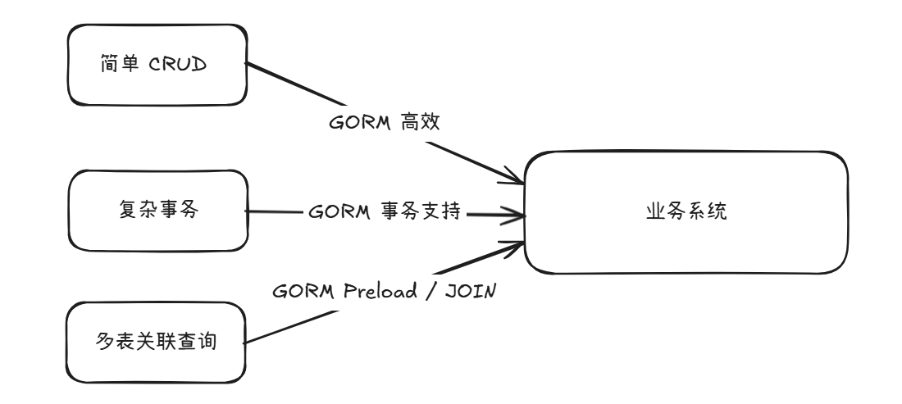

# GO & GORM 框架

## 一、ORM 框架的认识与理解

### 1. 什么是 ORM？

ORM（Object-Relational Mapping）即**对象关系映射**，是一种编程技术：

在数据库编程中，ORM框架的作用是：在**关系型数据库**和业务实体对象之间做映射，这样我们在操作业务对象的时候，就不需要再去和复杂的SQL语句打交道，只需要简单地操作对象的属性和方法。

- **核心思想​**：将数据库中的表 <=> 编程语言中的类/结构体
- ​**数据映射**​：表的列（Columns）<=> 结构体的字段（Fields）
- ​**操作映射**​：SQL操作（SELECT/INSERT等）<=> 面向对象的方法调用

|数据库	|面向对象的编程语言|
|:----|:----|
|表(table)	|类(class/struct)|
|记录(record, row)	|对象 (object)|
|字段(field, column)	|对象属性(attribute)|


> 例子
```sql
CREATE TABLE IF NOT EXISTS users (
    id BIGINT PRIMARY KEY,
    name VARCHAR(100),
    email VARCHAR(100) UNIQUE
);
```
> 映射为 Go 结构体 
```go
type User struct {
    ID    int    `gorm:"primaryKey"`
    Name  string 
    Email string `gorm:"uniqueIndex"`
}
```

---

### 2. 为什么需要 ORM？

#### 2.1. 提升开发效率

- 不再手动拼接SQL语句
- 避免大量重复CRUD代码

```go
// 传统方式
db.Exec("INSERT INTO users (name, email) VALUES (?, ?)", "Alice", "alice@example.com")

// ORM方式
db.Create(&User{Name: "Alice", Email: "alice@example.com"})
```

---

#### 2.2. 数据库无关性

- 同一套代码可适配多种**关系型**数据库（MySQL/PostgreSQL/SQLite等）

---

#### 2.3. 类型安全

- Go编译器会检查结构体字段类型，减少运行时错误

---

#### 2.4. 关系处理简化

- 轻松处理表关联（如一对多、多对多关系）

---

### 3. ORM的常见痛点

|问题	|说明	|解决方案示例|
|:-----|:-----|:-----|
|N+1查询问题	|遍历对象时触发多次查询	|GORM的Preload预加载|
|复杂查询支持	|特殊SQL语法难以表达	|GORM的Raw()/Scopes|
|性能损耗	|比直接SQL略有性能损失	|合理使用预加载/批量操作|
|学习曲线	|需掌握框架特有概念	|渐进式学习（我们正在做！）|

---

### 4. GORM 在 Go 生态中的定位

**主要特点​**：
- **全功能ORM​**：支持关联、事务、迁移、钩子等
- **​开发者友好​**：链式API设计、丰富的扩展点
- **​生态完善**​：兼容Prometheus、OpenTracing等工具



---

### 5. 核心思想总结

RM是通过面向对象的方式操作数据库的**翻译官**，而GORM是Go领域最强大的翻译官之一，它让开发者：

- 用结构体**描述**数据模型
- 用方法调用**替代**SQL编写
- 用对象思维**处理**数据库关系

---

## 二、GORM 的基本配置与使用

### 1. 环境安装与配置

#### 1.1. 安装 GORM

```bash
go get -u gorm.io/gorm
go get -u gorm.io/driver/mysql  # 以MySQL为例（其他数据库替换驱动即可）
```

---

#### 1.2. 数据库连接配置

关于DSN说明：
- `parseTime=True`：确保时间字段正确解析为 time.Time
- `loc=Local`：设置时区为系统本地时区（我们一般都是：Asia/Shanghai）

```go
package main

import (
	"gorm.io/driver/mysql"
	"gorm.io/gorm"
)

func main() {
	// 定义DSN (Data Source Name)
	dsn := "user:pass@tcp(127.0.0.1:3306)/dbname?charset=utf8mb4&parseTime=True&loc=Local"
	
	// 建立连接
	db, err := gorm.Open(mysql.Open(dsn), &gorm.Config{})
	if err != nil {
		panic("数据库连接失败: " + err.Error())
	}
	
	// 获取底层数据库连接池（重要！）
	sqlDB, _ := db.DB()
	defer sqlDB.Close() // 程序退出时关闭连接，defer关闭连接防止泄露
	
	// 连接池配置
	sqlDB.SetMaxOpenConns(100) // 最大连接数
	sqlDB.SetMaxIdleConns(10)  // 最大空闲连接
}
```


---

### 2. 模型定义的最佳实践

#### 2.1. 基础模型定义

```go
type User struct {
	ID        int64     `gorm:"primaryKey"`
	Name      string    `gorm:"type:varchar(100);not null"`
	Email     string    `gorm:"type:varchar(100);uniqueIndex"`
	CreatedAt time.Time // 自动记录创建时间（GORM约定）
	UpdatedAt time.Time // 自动记录更新时间（GORM约定）
}
```

---

#### 2.2. 常用的 GORM 标签

|标签	|作用	|示例|
|:-----|:-----|:-----|
|primaryKey	|设为主键	|gorm:"primaryKey"|
|uniqueIndex	|创建唯一索引	|gorm:"uniqueIndex"|
|not null	|非空约束	|gorm:"not null"|
|column	|自定义列名	|gorm:"column:user_name"|
|default	|设置默认值	|gorm:"default:'unknown'"|
|-	|忽略字段	|gorm:"-"|

----

#### 2.3. 模型嵌入用法

```go
// 封装公用字段
type BaseModel struct {
	ID        int64 `gorm:"primaryKey"`
	CreatedAt time.Time
	UpdatedAt time.Time
}

type Product struct {
	BaseModel // 嵌入
	Name      string
	Price     float64
}
```