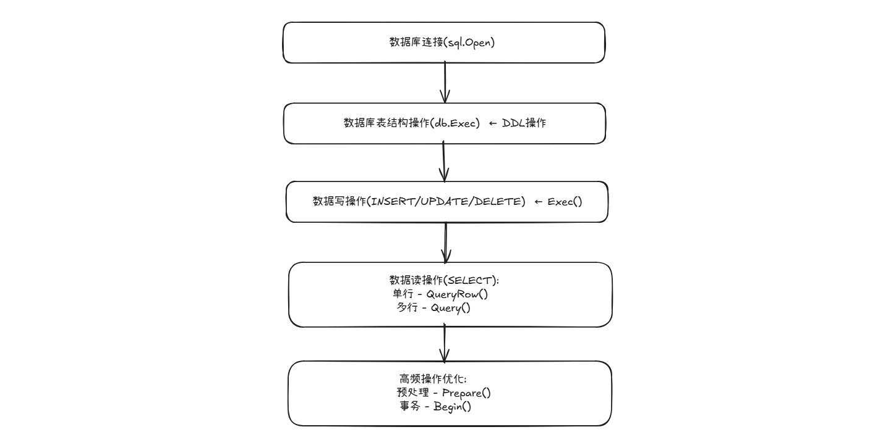

# Go Use MySQL —— 使用 Go 语言操作 MySQL

---

## 前置要求

### 1. MySQL 安装

安装：[【环境搭建】项目开发数据库选择指南：从类型特性到实战决策 —— Mysql&Redis](https://satori2core.github.io/notes/noteroot/project/%E6%95%B0%E6%8D%AE%E5%BA%93%E9%80%89%E6%8B%A9%E7%AD%96%E7%95%A5%E4%B8%8E%E5%AE%89%E8%A3%85.html)

---

### 2. 新建一个测试用户与权限分配

```sql
-- 步骤1: 登录MySQL（root用户）
sudo mysql -u root -p

-- 步骤2: 创建用户 (示例: 用户名为 myuser)
CREATE USER 'devuser'@'localhost' IDENTIFIED BY 'Dev200210_';

-- 步骤3: 授予权限：只允许用户管理特定前缀的数据库 (如 go_*)
GRANT CREATE, DROP ON `go\_%`.* TO 'devuser'@'localhost';   -- 用于演示 go 操作数据库的增删
GRANT ALL PRIVILEGES ON `testdb`.* TO `devuser`@`localhost` -- 用于作数据库连接测试

-- 如何移除指定权限（以移除数据库增删权限为例）
-- REVOKE CREATE, DROP ON *.* FROM 'devuser'@'localhost';

-- 步骤4: 刷新权限
FLUSH PRIVILEGES;

-- 步骤5：权限校验
SHOW GRANTS FOR 'devuser'@'localhost';

-- 步骤6: 退出
EXIT;
```

---

- 权限检查示例

```sql
mysql> SHOW GRANTS FOR 'devuser'@'localhost';
+-------------------------------------------------------------+
| Grants for devuser@localhost                                |
+-------------------------------------------------------------+
| GRANT USAGE ON *.* TO `devuser`@`localhost`                 |
| GRANT ALL PRIVILEGES ON `testdb`.* TO `devuser`@`localhost` |
| GRANT CREATE, DROP ON `go\_%`.* TO `devuser`@`localhost`    |
+-------------------------------------------------------------+
3 rows in set (0.00 sec)
```

---

## 驱动安装与数据库基本连接

### 1. 安装 MySQL 驱动（Go包）

在项目目录中执行：

```bash
go get github.com/go-sql-driver/mysql
```

---

### 2. Go 程序中的基础连接设置

DSN(Data Source Name)配置格式：
- 格式：`[username]:[password]@tcp([host]:[port])/[database]`

```go
// 注意：import _ "github.com/go-sql-driver/mysql" // 匿名导入驱动

func main() {
	// DSN 格式：`[username]:[password]@tcp([host]:[port])/[database]`
	dsn := "devuser:Dev200210_@tcp(127.0.0.1:3306)/testdb"
	// dsn := "devuser:Dev200210_@tcp(localhost:3306)/"	// 不指定具体数据库

	// 建立数据库连接（此时已未制定具体数据库）
	db, err := sql.Open("mysql", dsn)
	if err != nil {
		log.Fatal("连接失败：", err)
	}
	defer db.Close()

	// 验证连接
	if err := db.Ping(); err != nil {
		log.Fatal("连接验证失败：", err)
	}
	fmt.Println("成功连接到MySQL服务器!")
}
```

---

**【程序连接验证】**

```bash
# 示例：开始 -----------------------------------------------------------------------------
➜  ConnectionToMySQL git:(learn/GoUseMySQL) ✗ ll
总计 4.0K
-rw-rw-r-- 1 devuser devuser 637  6月 24 23:05 main.go
➜  ConnectionToMySQL git:(learn/GoUseMySQL) ✗ go build -o conntest    # 编译
➜  ConnectionToMySQL git:(learn/GoUseMySQL) ✗ ./conntest              # 执行测试
成功连接到MySQL服务器!
➜  ConnectionToMySQL git:(learn/GoUseMySQL) ✗ 
# 示例：结束 -----------------------------------------------------------------------------
```

---

## Go 操作数据库

> 完全使用Go语言进行表操作，包括数据表的创建、删除、表的字段变更、索引变更。

### 1. 创建/删除数据表

**代码示例**

> 注意：权限分配问题。如本文开头。

```go
func main() {
	dsn := "devuser:Dev200210_@tcp(127.0.0.1:3306)/"
	db, err := sql.Open("mysql", dsn)
	if err != nil {
		log.Fatal("连接失败：", err)
	}
	defer db.Close()

	// 创建数据库
	createDatabase(db)

	// 删除数据库
	deleteDatabase(db)
}

// 创建数据库
func createDatabase(db *sql.DB) {
	_, err := db.Exec("CREATE DATABASE IF NOT EXISTS go_db DEFAULT CHARSET utf8mb4 COLLATE utf8mb4_unicode_ci")
	if err != nil {
		log.Fatal("，数据库创建失败：", err)
	}
	fmt.Println("数据库创建成功！")

	// 使用新建的数据库
	_, err = db.Exec("use go_db")
	if err != nil {
		log.Fatal("切换数据库失败: ", err)
	}
}

// 删除数据库
func deleteDatabase(db *sql.DB) {
	_, err := db.Exec("DROP DATABASE IF EXISTS go_db")
	if err != nil {
		log.Fatal("删除数据库失败: ", err)
	}
	fmt.Println("数据库删除成功!")
}
```

---

### 2. 操作效果演示

```bash
# 示例：开始 -----------------------------------------------------------------------------
➜  OperateDatabase git:(learn/GoUseMySQL) ✗ go build -o test
➜  OperateDatabase git:(learn/GoUseMySQL) ✗ ./test          
数据库创建成功！
数据库删除成功!
➜  OperateDatabase git:(learn/GoUseMySQL) ✗ 
# 示例：结束 -----------------------------------------------------------------------------
```

---

## Go 操作数据表

### 1. 创建/删除数据表

```go
// 创建基本表结构
func createUserTable(db *sql.DB) {
	sql := `
		CREATE TABLE IF NOT EXISTS users (
			user_id INT UNSIGNED NOT NULL AUTO_INCREMENT COMMENT '主键',
			username VARCHAR(50) NOT NULL COMMENT '用户名',
			email VARCHAR(100) NOT NULL COMMENT '邮箱地址',
			create_at DATETIME DEFAULT CURRENT_TIMESTAMP,
			PRIMARY KEY (user_id)
		) ENGINE=InnoDB DEFAULT CHARSET=utf8mb4
	`

	_, err := db.Exec(sql)
	if err != nil {
		log.Fatal("创建表失败：", err)
	}
	fmt.Println("user表创建成功！")
}

// 删除表
func dropUserTable(db *sql.DB) {
	_, err := db.Exec("DROP TABLE IF EXISTS users")
	if err != nil {
		log.Fatal("删除表失败：", err)
	}
	fmt.Println("user表删除成功！")
}
```

---

### 2. 数据表列操作（增删改）

```go
// 添加新列
func addColumn(db *sql.DB) {
	_, err := db.Exec("ALTER TABLE users ADD COLUMN last_login DATETIME DEFAULT NULL AFTER email")
	if err != nil {
		log.Fatal("添加列失败: ", err)
	}
	fmt.Println("成功添加last_login列")
}

// 修改列类型
func modifyColumn(db *sql.DB) {
	_, err := db.Exec("ALTER TABLE users MODIFY COLUMN username VARCHAR(70) NOT NULL")
	if err != nil {
		log.Fatal("修改列失败: ", err)
	}
	fmt.Println("成功修改username列类型")
}

// 重命名列
func renameColumn(db *sql.DB) {
	_, err := db.Exec("ALTER TABLE users RENAME COLUMN last_login TO last_login_rename_test")
	if err != nil {
		log.Fatal("重命名列失败: ", err)
	}
	fmt.Println("成功重命名email列")
}

// 删除列
func dropColumn(db *sql.DB) {
	_, err := db.Exec("ALTER TABLE users DROP COLUMN last_login_rename_test")
	if err != nil {
		log.Fatal("删除列失败: ", err)
	}
	fmt.Println("成功删除last_login列")
}
```

---

### 3. 数据表索引操作

**索引**
- 普通索引
- 唯一键索引
- 符合索引

```go
// 添加普通索引
func addIndex(db *sql.DB) {
	_, err := db.Exec("CREATE INDEX idx_username ON users (username)")
	if err != nil {
		log.Fatal("添加索引失败: ", err)
	}
	fmt.Println("成功添加username索引")
}

// 添加唯一索引
func addUniqueIndex(db *sql.DB) {
	_, err := db.Exec("CREATE UNIQUE INDEX uidx_email ON users (email)")
	if err != nil {
		log.Fatal("添加唯一索引失败: ", err)
	}
	fmt.Println("成功添加email唯一索引")
}

// 添加复合索引
func addCompositeIndex(db *sql.DB) {
	_, err := db.Exec("CREATE INDEX idx_user_status ON users (username, email)")
	if err != nil {
		log.Fatal("添加复合索引失败: ", err)
	}
	fmt.Println("成功添加复合索引")
}

// 删除索引
func dropIndex(db *sql.DB) {
	_, err := db.Exec("DROP INDEX idx_username ON users")
	if err != nil {
		log.Fatal("删除索引失败: ", err)
	}
	fmt.Println("成功删除username索引")
}
```

---

### 4. 综合操作演示

> 案例程序

```go
func main() {
	dsn := "devuser:Dev200210_@tcp(localhost:3306)/"

	db, err := sql.Open("mysql", dsn)
	if err != nil {
		log.Fatal("连接失败：", err)
	}
	defer db.Close()

	// 选择使用 testdb 数据库
	_, err = db.Exec("use testdb")
	if err != nil {
		log.Fatal("切换数据库失败：", err)
	}

	// 表操作
	createUserTable(db)

	// 列操作演示
	addColumn(db)
	modifyColumn(db)
	renameColumn(db)
	dropColumn(db)

	// 索引操作演示
	addIndex(db)
	addUniqueIndex(db)
	addCompositeIndex(db)
	dropIndex(db)

	// 6. 清理（可选）
	dropUserTable(db)
}
```

---

> 效果示例

```bash
# 示例：开始 -----------------------------------------------------------------------------
➜  OperateTable git:(learn/GoUseMySQL) ✗ go build -o test
➜  OperateTable git:(learn/GoUseMySQL) ✗ ./test          
user表创建成功！
成功添加last_login列
成功修改username列类型
成功重命名email列
成功删除last_login列
成功添加username索引
成功添加email唯一索引
成功添加复合索引
成功删除username索引
user表删除成功！
➜  OperateTable git:(learn/GoUseMySQL) ✗ 
# 示例：结束 -----------------------------------------------------------------------------
```

---

## Go原生MySQL操作指南

**Go 语言操作 Mysql 的理解**：
- `Go语言原生操作MySQL的核心就是通过 sql.DB 实例的 Exec() 等方法执行原始SQL语句`

---

### 1. 核心方法使用场景对照表

|操作类型	|推荐方法	|返回值	|使用场景|
|:--------|:--------|:--------|:--------|
|​数据库DDL​	|Exec()	|sql.Result	|创建/删除数据库|
|​表结构DDL​	|Exec()	|sql.Result	|建表/删表/列操作/索引操作|
|​写操作​	|Exec()	|sql.Result	|INSERT/UPDATE/DELETE|
|​单行查询​	|QueryRow()	|*sql.Row	|获取单条记录（如按ID查询）|
|​多行查询​	|Query()	|*sql.Rows	|获取多条记录（如列表查询）|
|​预处理语句​	|Prepare()	|*sql.Stmt	|高频重复SQL操作|
|​事务操作​	|Begin()	|*sql.Tx	|多操作原子执行|

---

### 2. 数据库操作（DDL）

- **核心方法：`Exec()`**

#### 2.1 数据库：增/删/切换

```go
// 创建数据库
_, err := db.Exec("CREATE DATABASE IF NOT EXISTS shop DEFAULT CHARSET utf8mb4")

// 删除数据库
_, err := db.Exec("DROP DATABASE IF EXISTS shop_old")

// 切换数据库
_, err := db.Exec("USE shop")
```

---

#### 2.2 表操作：增/删/改/索引

> 此处简略演示，更多使用：可以看前文【Go 操作数据表】部分

```go
// 创建表
_, err := db.Exec(`CREATE TABLE products (
    id INT AUTO_INCREMENT PRIMARY KEY,
    name VARCHAR(100) NOT NULL,
    price DECIMAL(10,2) NOT NULL DEFAULT 0.00,
    created_at TIMESTAMP DEFAULT CURRENT_TIMESTAMP
) ENGINE=InnoDB`)

// 删除表
_, err := db.Exec("DROP TABLE IF EXISTS temp_products")

// 修改表结构
_, err := db.Exec("ALTER TABLE products ADD COLUMN stock INT DEFAULT 0")

// 索引操作
_, err := db.Exec("CREATE INDEX idx_product_name ON products (name)")
_, err := db.Exec("DROP INDEX idx_product_name ON products")
```

---

### 3. 数据操作（DML）

#### 3.1 写操作（INSERT/UPDATE/DELETE）

- **核心方法：`Exec()`**
- 相关方法：
	- `(sql.Result).LastInsertId()`：获取插入ID
	- `(sql.Result).RowsAffected()`：获取影响行数

```go
// 插入数据（带参数）
result, err := db.Exec(
    "INSERT INTO products (name, price) VALUES (?, ?)",
    "Go语言教程", 88.88
)

// 获取插入ID
newID, _ := result.LastInsertId()

// 更新数据
result, err := db.Exec(
    "UPDATE products SET price = ? WHERE id = ?",
    99.99, 100
)

// 获取影响行数
rowsAffected, _ := result.RowsAffected()

// 删除数据
result, err := db.Exec("DELETE FROM products WHERE id = ?", 101)
```

---


#### 3.2 读操作（SELECT）

- **核心方法：`QueryRow() / Query()`**​
- `QueryRow()`：获取单条记录（如按ID查询）
- `Query()`：获取多条记录（如列表查询），
	- 注意：多行查询，必须关闭结果集（如下示例）

```go
// 单行查询
var (
    name  string
    price float64
)
err := db.QueryRow(`
    SELECT name, price FROM products WHERE id = ?
`, 100).Scan(&name, &price)

// 多行查询
rows, err := db.Query(`
    SELECT id, name, price FROM products WHERE price > ? 
`, 50.0)
defer rows.Close() // 必须关闭结果集

for rows.Next() {
    var (
        id    int
        name  string
        price float64
    )
    if err := rows.Scan(&id, &name, &price); err != nil {
        log.Fatal(err)
    }
    fmt.Printf("%d: %s - ¥%.2f\n", id, name, price)
}

// 检查迭代错误
if err = rows.Err(); err != nil {
    log.Fatal("遍历结果出错:", err)
}
```

---


### 4. 最佳实践与安全防护

#### 4.1 SQL注入防御对照表

|方法	|安全性	|示例|
|:------|:------|:------|
|字符串拼接 1	|❌ 高风险	|"SELECT * FROM users WHERE id = " + userInput|
|字符串拼接 2	|❌ 高风险	|fmt.Sprintf("SELECT * FROM users WHERE id = %s", userInput)|
|参数化查询（？占位）	|✅ 安全	|db.Query("... WHERE id = ?", userInput)|
|预处理语句	|✅ 安全+高性能	|见下方示例|

---

#### 4.2 预处理语句使用

```go
// 准备预处理语句
stmt, err := db.Prepare("INSERT INTO products (name, price) VALUES (?, ?)")
if err != nil {
    log.Fatal(err)
}
defer stmt.Close() // 必须关闭

// 批量插入
products := []struct {
    Name  string
    Price float64
}{
    {"鼠标", 59.9},
    {"键盘", 129.0},
    {"显示器", 899.0},
}

for _, p := range products {
    _, err := stmt.Exec(p.Name, p.Price)
    if err != nil {
        log.Printf("插入失败: %v", err)
    }
}
```

---

#### 4.3 NULL值处理方案

```go
// 声明可空变量
var (
    name  sql.NullString
    price sql.NullFloat64
)

// 扫描处理
err := db.QueryRow("SELECT name, price FROM products WHERE id = 101").Scan(
    &name, &price,
)

if name.Valid {
    fmt.Println("商品名:", name.String)
} else {
    fmt.Println("商品名未设置")
}

if price.Valid {
    fmt.Printf("价格: ¥%.2f", price.Float64)
} else {
    fmt.Println("价格未设置")
}
```

---

#### 4.4 事务处理范例

- **关键方法：`Begin()`**

```go
tx, err := db.Begin()
if err != nil {
    log.Fatal(err)
}

// 异常时回滚
defer func() {
    if r := recover(); r != nil {
        tx.Rollback()
    }
}()

// 执行事务操作
_, err = tx.Exec("UPDATE accounts SET balance = balance - ? WHERE id = ?", 100.0, 1)
if err != nil {
    tx.Rollback()
    log.Fatal(err)
}

_, err = tx.Exec("UPDATE accounts SET balance = balance + ? WHERE id = ?", 100.0, 2)
if err != nil {
    tx.Rollback()
    log.Fatal(err)
}

// 提交事务
if err = tx.Commit(); err != nil {
    log.Fatal(err)
}
```

---

### 5. 完整操作流程示意




---