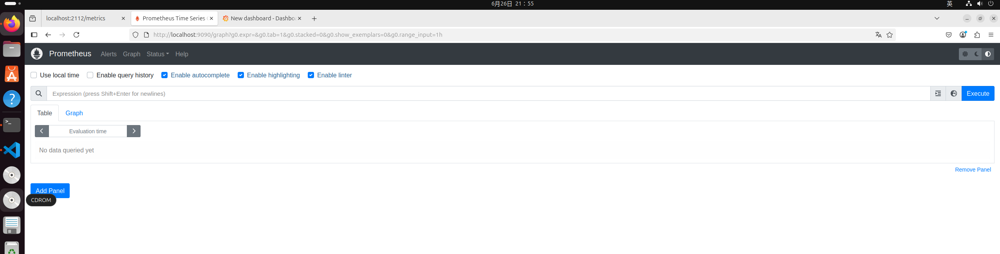
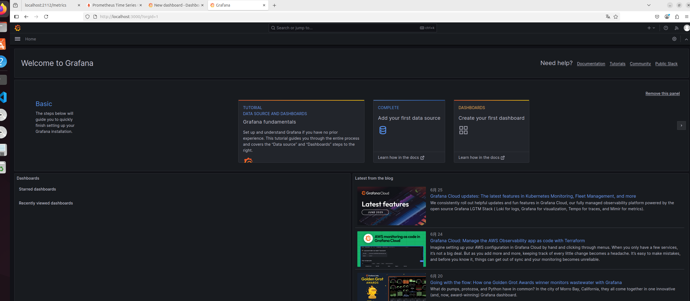
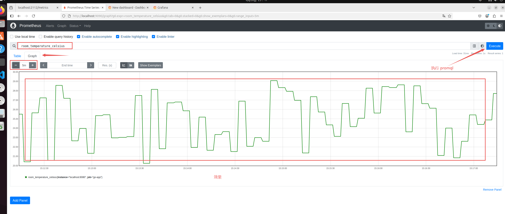
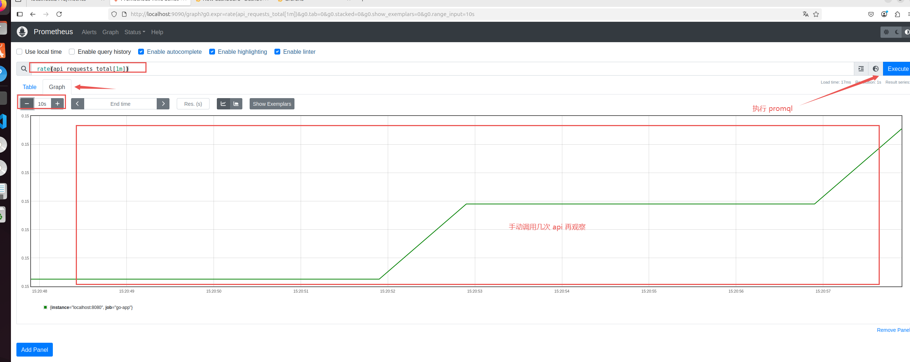

# Go With Grafana And Prometheus


## Prometheus & Grafana 简单认识与理解

### 1. 什么是 Prometheus？

#### 1.1 通俗理解

👉 它是个`「监控数据管家」`，专门收集和存储各种监控指标的数字（比如CPU温度、网站访问量、内存用量等）并**保存在它自带的数据库里**。

---

#### 1.2 核心功能

|特点	|说明|
|:------|:------|
|📈 时间序列数据库	|按时间顺序记录指标变化（如：CPU使用率每分钟的值）|
|🔍 主动拉取模式	|定期去各个服务"抄表"（HTTP访问 /metrics 接口）|
|🔔 告警系统	|发现异常时能自动发送报警（需要额外配置Alertmanager）|
|🧩 多维数据模型	|用标签区分数据（如区分不同服务器的CPU指标）|

---


### 2. 什么是 Grafana？

#### 2.1 ​通俗理解​：

👉 它是个`「数据可视化画家」`，能把枯燥的数字变成漂亮的**图表和仪表盘**。它**不存储数据，只负责展示**。

---


#### 2.2 核心能力​

|特点	|说明|
|:------|:------|
|🎨 可视化专家	|支持折线图/柱状图/仪表盘/热力图等30+图表类型|
|🔌 万能连接器	|能对接Prometheus、MySQL、InfluxDB等50+数据源|
|📱 看板定制	|自由组合监控面板（类似组装汽车仪表盘）|
|🚨 智能告警	|可基于图表阈值设置报警规则|

----

## 安装部署（Ubuntu版）

### 1. 安装 Prometheus

```bash
# 下载安装包（最新稳定版）
wget https://github.com/prometheus/prometheus/releases/download/v2.48.0/prometheus-2.48.0.linux-amd64.tar.gz

# 解压到系统目录
tar xvfz prometheus-*.tar.gz
sudo mv prometheus-2.48.0.linux-amd64 /opt/prometheus
```

---

### 2. Prometheus 配置与启动

```bash
# 创建配置文件（保留默认配置即可）
sudo nano /opt/prometheus/prometheus.yml

# 启动服务（前台运行方便调试）
cd /opt/prometheus
./prometheus
```

✅ ​验证安装​：浏览器打开 http://localhost:9090 【ip可根据实际需求修改】




---

### 3. 安装 Grafana

```bash
# 下载安装包
wget https://dl.grafana.com/oss/release/grafana-10.2.1.linux-amd64.tar.gz

# 解压到系统目录
tar xvfz grafana-*.tar.gz
sudo mv grafana-10.2.1 /opt/grafana
```

---

### 4. Grafana 启动与验证

```bash
# 启动服务
cd /opt/grafana/bin
./grafana-server
```

✅ ​验证安装​：浏览器打开 http://localhost:3000 【ip可根据实际需求修改】

🔑 默认账号: admin(账号)/admin(密码) 
> (首次登录要求改密码)



---


## Go 程序集成 Prometheus 指南

> Go程序中集成监控的基本流程


### 1. 安装依赖包

- **目的**​：让Go程序具备监控能力

```bash
go get github.com/prometheus/client_golang/prometheus
go get github.com/prometheus/client_golang/prometheus/promhttp
```

|包名	|作用	|类比解释|
|:------|:------|:------|
|prometheus	|核心功能：创建指标	|建造监控仪表的零部件|
|promhttp	|提供HTTP接口暴露指标数据	|给仪表盘接上显示屏幕|

---

### 2. 四大核心指标类型

#### 2.0 指标类型选择思路

📊 指标类型选择思路：

- 统计累计次数​ → 用计数器
- 监控当前状态​ → 用仪表盘
- 分析数据分布​ → 用直方图或摘要

---

#### 2.1 计数器 Counter

- **计数器**：只能增加的数值（如总请求量）
- **关键方法**：`NewCounter()`
```go
prometheus.NewCounter(
    prometheus.CounterOpts{
        Name: "login_attempts_total",
        Help: "用户登录尝试总次数",
    }
)
```

---

#### 2.2 仪表盘 Gauge

- **仪表盘**：可增减的瞬时值（如内存使用量）
- **关键方法**：`NewGauge()`
```go
prometheus.NewGauge(
    prometheus.GaugeOpts{
        Name: "active_users",
        Help: "当前在线用户数量",
    }
)
```

---

#### 2.3 直方图 Histogram

- **直方图**：记录数据分布（如请求延迟）
- **关键方法**：`NewHistogram()`
```go
prometheus.NewHistogram(
    prometheus.HistogramOpts{
        Name:    "api_response_time",
        Help:    "API响应时间分布(秒)",
        Buckets: []float64{0.1, 0.5, 1, 2}, // 数据分段值
    }
)
```

---
##### 2.4 摘要 Summary

- **摘要**：更高级的数据分布统计
- **关键方法**：`NewSummary()`

```go
prometheus.NewSummary(
    prometheus.SummaryOpts{
        Name: "order_value_summary",
        Help: "订单金额统计分布",
    }
)
```

---

#### 2.5 核心指标字段说明

##### **通用字段​（所有类型共有）**
```go
type Opts struct {
    Name        string    // 指标名称（必需）
    Help        string    // 指标描述（必需）
    Namespace   string    // 命名空间（前缀，如`app_`）
    Subsystem   string    // 子系统（子类别前缀）
    ConstLabels Labels    // 固定标签（键值对）
}
```
---

##### ​Counter/Gauge​（计数器和仪表）

- ​无额外字段，直接使用基础Opts
```go
// Counter
prometheus.CounterOpts{
    Name: "login_attempts_total", 
    Help: "用户登录尝试总次数",
    // 无专属字段
}

// Gauge
prometheus.GaugeOpts{
    Name: "active_users", 
    Help: "当前在线用户数量",
    // 无专属字段
}
```

---

##### Histogram​（直方图）

- 新增 ​**Buckets**​ 字段（必需）

```go
type HistogramOpts struct {
    Opts                   // 包含通用字段
    Buckets []float64      // 自定义桶边界（必需！）
}
```

**示例**

```go
prometheus.HistogramOpts{
    Name:    "api_response_time",
    Help:    "API响应时间分布(秒)",
    Buckets: []float64{0.1, 0.5, 1, 2}, // 专属字段：定义桶边界
}
```

---

##### Summary​（摘要）

- 新增 **​分位数统计字段​**：

```go
type SummaryOpts struct {
    Opts                                    // 通用字段
    Objectives map[float64]float64           // 分位数目标（如{0.5: 0.05, 0.9: 0.01}）
    MaxAge     time.Duration                 // 观察值保留窗口（默认10分钟）
    AgeBuckets uint32                        // 窗口内桶数量
    BufCap     uint32                        // 样本缓冲区大小
}
```

- 关键专属字段：​**Objectives**​（必需）

```go
prometheus.SummaryOpts{
    Name: "order_value_summary",
    Help: "订单金额统计分布",
    Objectives: map[float64]float64{
        0.5: 0.05,   // 中位数，误差5%
        0.9: 0.01,   // P90，误差1%
    },
}
```

---


##### 字段必要性总结

|字段类型	|所有类型必需	|类型专属必需字段	|专属可选字段|
|:---------|:---------|:---------|:---------|
|​Name​	|✅	|-	|-|
|​Help​	|✅	|-	|-|
|​Buckets​	|-	|Histogram专用✅|	-|
|​Objectives​	|-	|Summary专用✅|	-|
|Namespace	|❌（可选）	|-	|-|
|Subsystem	|❌（可选）	|-	|-|
|ConstLabels	|❌（可选）	|-	|-|
|MaxAge/AgeBuckets/BufCap	|-	|-	|Summary专用❌（有默认值）|


---


### 3. 使用示例（两个样例）

```go
// 定义指标
var (
	// 示例一：随机温度计（仪表盘）
	tempGauge = prometheus.NewGauge(
		prometheus.GaugeOpts{
			Name: "room_temperature_celsius",
			Help: "当前室温摄氏度",
		},
	)

	// 示例二：API调用计数器
	apiCounter = prometheus.NewCounter(
		prometheus.CounterOpts{
			Name: "api_requests_total",
			Help: "API总调用次数",
		},
	)
)

func main() {
	// 示例一：随机温度计（仪表盘）
	ExampleOne()

	// 示例二：API调用计数器
	ExampleTwo()

	// 露监控端点
	http.Handle("/metrics", promhttp.Handler())

	println("服务启动：:8080")
	http.ListenAndServe(":8080", nil)
}

// 示例一：随机温度计（仪表盘）
func ExampleOne() {
	// 注册到默认注册表
	prometheus.MustRegister(tempGauge)

	// 后台定时更新指标值
	// 模拟温度度变化
	go func() {
		for {
			// 生成20-30之间的随机温度
			temp := 20 + rand.Float64()*10
			tempGauge.Set(temp)
			time.Sleep(5 * time.Second)
		}
	}()
}

// 示例二：API调用计数器
func ExampleTwo() {
	// 注册到默认注册表
	prometheus.MustRegister(apiCounter)

	// 业务接口
	http.HandleFunc("/api", func(w http.ResponseWriter, r *http.Request) {
		// 每次调用API时计数器+1
		apiCounter.Inc()
		w.Write([]byte("API请求成功"))
	})
}
```

---

### 4. 本地观察运行效果

- **目的**​：验证监控数据是否正常输出

> 启动程序
```bash
go run main.go

# 示例：开始 -----------------------------------------------------------------------------
➜  UsePrometheus git:(learn/GrafanaWithPrometheus) ✗ go run main.go
服务启动：:8080

# 示例：结束 -----------------------------------------------------------------------------
```

> 访问业务接口（此处访问10次，后续便于观察数据）

```bash
curl http://localhost:8080/api
# 多次调用查看计数器变化
```

> 检查监控端点

```bash
curl http://localhost:8080/metrics

# 输出的内容可能较多，但是可以搜索找到示例程序设置的指标
# 示例：开始 -----------------------------------------------------------------------------
➜  UsePrometheus git:(learn/GrafanaWithPrometheus) ✗ curl http://localhost:8080/metrics
# HELP api_requests_total API总调用次数
# TYPE api_requests_total counter
api_requests_total 10

# HELP room_temperature_celsius 当前室温摄氏度
# TYPE room_temperature_celsius gauge
room_temperature_celsius 21.09880076230137
# 示例：结束 -----------------------------------------------------------------------------
```

---

### 5. 在Prometheus页面操作（观察效果）

> 目的​：将监控数据接入系统

#### 5.1 配置抓取任务

> 需要修改配置文件（prometheus.yml），制定要抓取的程序地址

```bash
# 指定修改：prometheus.yml

# 写入内容
scrape_configs:
  # The job name is added as a label `job=<job_name>` to any timeseries scraped from this config.
  - job_name: "go-app"  # 名称
    scrape_interval: 5s # 每5秒抓取一次
    static_configs:
      - targets: ["localhost:8080"] # Go 应用地址

# 示例：开始 -----------------------------------------------------------------------------
➜  LearnGoPkgTools git:(learn/GrafanaWithPrometheus) ✗ sudo vim /opt/prometheus/prometheus.yml # 编辑配置文件
➜  LearnGoPkgTools git:(learn/GrafanaWithPrometheus) ✗ cd /opt/prometheus                      # 切换目录
➜  prometheus ./prometheus --config.file=prometheus.yml                                        # 启动程序，并指定配置文件
# 示例：结束 -----------------------------------------------------------------------------
```

---


#### 5.2 执行PromQL查询

- 访问：http://localhost:9090
- 在Prometheus的Graph页面
```promql
# 查询当前室温
room_temperature_celsius

# 查询API每分钟请求量（需要再次去调用接口，以便于观察到结果：curl http://localhost:8080/api）
rate(api_requests_total[1m])
```

> 查询当前室温



> 查询API每分钟请求量




---


